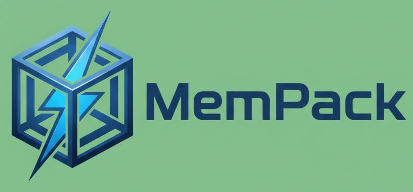

# MemPack



A portable, fast knowledge pack with two-file ANN memory for semantic search and retrieval.

## Overview

MemPack is a Python library that packages text chunks + metadata + integrity info into **one container file** (`.mpack`) and a **separate ANN index** (`.ann`). It's designed for portability, deterministic random access, fast semantic retrieval, and clean APIs.

At its heart, mempack is a knowledge container that works like a hybrid between a structured archive and a vector database:

- Container file **(.mpack)** – Holds compressed text chunks, metadata, and integrity checks.

- Index file **(.ann)** – Stores a memory-mappable Approximate Nearest Neighbor (ANN) index (e.g., HNSW) for fast retrieval.

This separation ensures that data remains portable, compact, and deterministic, while the index is directly mmap-able for lightning-fast loading and search.

### Why MemPack?

- **Two-file format**: Clean separation of data (`.mpack`) and index (`.ann`)
- **Fast retrieval**: Sub-100ms vector search with HNSW indexing
- **Portable**: No database dependencies, works with just files
- **Integrity**: Built-in checksums and optional ECC error correction
- **Memory efficient**: Memory-mappable index with block caching


## Comparison: MemPack vs Vector Stores

| Feature | MemPack | Traditional Vector Stores |
|---------|---------|---------------------------|
| **Deployment** | Two files (.mpack + .ann) | Database server + infrastructure |
| **Dependencies** | None (pure Python) | Database, network, API keys |
| **Offline Support** | ✅ Full offline capability | ❌ Requires network connectivity |
| **Cold Start** | ⚡ Milliseconds (memory-mapped) | 🐌 Minutes (load all vectors) |
| **Memory Usage** | 💾 Efficient (block caching) | 🔥 High (load entire dataset) |
| **Data Integrity** | ✅ Built-in checksums + ECC | ❌ Opaque, no verification |
| **Version Control** | ✅ Git-friendly, diffable | ❌ No version tracking |
| **Portability** | 🌍 Universal file format | 🔒 Vendor lock-in |
| **Cost Model** | 💰 One-time build, unlimited queries | 💸 Per-query or per-vector pricing |
| **Setup Complexity** | 🚀 `pip install` + 2 files | 🏗️ Infrastructure, config, scaling |
| **Edge Computing** | ✅ Runs on any device | ❌ Requires cloud connectivity |
| **Data Recovery** | ✅ Transparent format, ECC repair | ❌ Black box, no recovery |
| **Collaboration** | ✅ Share files, track changes | ❌ Complex multi-user setup |
| **Debugging** | 🔍 Inspect files, built-in tools | 🐛 Opaque APIs, limited visibility |
| **Resource Requirements** | 📱 Minimal (Raspberry Pi ready) | 🖥️ High (dedicated servers) |
| **Deterministic** | ✅ Reproducible builds | ❌ Non-deterministic indexing |

### When to Choose MemPack
- ✅ Offline-first applications
- ✅ Edge computing and IoT
- ✅ Cost-sensitive high-volume queries
- ✅ Data integrity is critical
- ✅ Version control and collaboration
- ✅ Simple deployment requirements
- ✅ Resource-constrained environments

### When to Choose Vector Stores
- ✅ Real-time updates to knowledge base
- ✅ Multi-tenant SaaS applications
- ✅ Complex filtering and metadata queries
- ✅ Integration with existing database infrastructure
- ✅ Need for advanced vector operations (clustering, etc.)


## Use Cases: Why MemPack Beats Vector Stores

### 🚀 **Offline-First Knowledge Management**
**Problem**: Traditional vector stores require constant network connectivity and database servers running 24/7.

**MemPack Solution**: 
- Build once, run anywhere with just two files
- Zero infrastructure overhead - no servers, databases, or cloud dependencies
- Perfect for air-gapped environments, edge computing, and offline research

**Example**: Research team working with sensitive data in isolated environments can build knowledge packs locally and share them as simple files.

### 📦 **Portable Knowledge Distribution**
**Problem**: Vector stores lock you into specific platforms (Pinecone, Weaviate, etc.) with vendor lock-in and complex deployment.

**MemPack Solution**:
- Universal file format that works across any system
- Version control friendly - track knowledge changes with Git
- Easy sharing via email, cloud storage, or USB drives
- No vendor dependencies or API keys required

**Example**: Open-source project documentation that needs to work offline and be easily distributable to contributors worldwide.

### ⚡ **Lightning-Fast Cold Starts**
**Problem**: Vector stores have cold start penalties - loading millions of vectors takes minutes and requires significant memory.

**MemPack Solution**:
- Memory-mappable index loads in milliseconds
- Deterministic random access - no need to load entire dataset
- Efficient block caching with LRU eviction
- Sub-100ms search even on first query

**Example**: Serverless functions that need instant knowledge retrieval without warm-up time.

### 🔒 **Data Integrity & Reliability**
**Problem**: Vector stores are "black boxes" - you can't verify data integrity or recover from corruption.

**MemPack Solution**:
- Built-in XXH3 checksums for every data block
- Optional Reed-Solomon error correction for data recovery
- Transparent file format - you can inspect and repair data
- Deterministic builds ensure reproducible results

**Example**: Critical applications where data corruption could be catastrophic (medical, financial, legal).

### 💾 **Memory & Storage Efficiency**
**Problem**: Vector stores often require 2-3x memory overhead and complex caching strategies.

**MemPack Solution**:
- Compressed text storage (Zstd) with fast decompression
- Memory-mappable index with zero-copy access
- Configurable block caching (default 1GB)
- No duplicate data storage between index and content

**Example**: Mobile applications or embedded systems with limited memory and storage.

### 🔄 **Version Control & Collaboration**
**Problem**: Vector stores make it impossible to track changes, compare versions, or collaborate on knowledge bases.

**MemPack Solution**:
- Text-based format that works with Git
- Diff-friendly - see exactly what changed between versions
- Branch and merge knowledge bases like code
- Easy rollback to previous versions

**Example**: Documentation teams that need to track knowledge evolution and collaborate on content updates.

### 🛠️ **Developer Experience**
**Problem**: Vector stores require complex setup, API keys, rate limits, and debugging through opaque APIs.

**MemPack Solution**:
- Simple Python API with clear error messages
- Local development with zero external dependencies
- Comprehensive CLI for all operations
- Built-in verification and debugging tools

**Example**: Rapid prototyping and development where you need to iterate quickly without infrastructure complexity.

### 🌐 **Edge Computing & IoT**
**Problem**: Vector stores require internet connectivity and can't run on resource-constrained devices.

**MemPack Solution**:
- Runs entirely offline with minimal resource requirements
- No network calls or external dependencies
- Optimized for ARM processors and embedded systems
- Predictable performance regardless of network conditions

**Example**: IoT devices that need local knowledge retrieval without internet connectivity.

### 📊 **Cost Efficiency**
**Problem**: Vector stores charge per query, per vector, or require expensive infrastructure.

**MemPack Solution**:
- One-time build cost, unlimited queries
- No per-query pricing or rate limits
- Runs on any hardware - from Raspberry Pi to enterprise servers
- No ongoing operational costs

**Example**: High-volume applications where per-query costs would be prohibitive.

## Quick Start

### Installation

```bash
pip install mempack
```

### Basic Usage

```python
from mempack import MemPackEncoder, MemPackRetriever

# Build a knowledge pack
encoder = MemPackEncoder(chunk_size=300, chunk_overlap=50)
encoder.add_text("# Introduction\nQuantum computers use qubits...", 
                 meta={"source": "notes/quantum.md"})
encoder.build(pack_path="kb.mpack", ann_path="kb.ann")

# Search the knowledge pack
retriever = MemPackRetriever(pack_path="kb.mpack", ann_path="kb.ann")
hits = retriever.search("quantum computing", top_k=5)
for hit in hits:
    print(f"Score: {hit.score:.3f}")
    print(f"Source: {hit.meta.get('source')}")
    print(f"Text: {hit.text[:120]}...")
    print()
```

### LLM Integration

MemPack provides built-in chat functionality that works with any LLM client:

```python
from mempack import MemPackRetriever, MemPackChat

# Initialize retriever
retriever = MemPackRetriever(pack_path="kb.mpack", ann_path="kb.ann")

# Create chat interface
chat = MemPackChat(
    retriever=retriever,
    context_chunks=8,           # Number of chunks to use as context
    max_context_length=2000,    # Max context length in characters
)

# Example with OpenAI (or any LLM client)
import openai

class OpenAIClient:
    def __init__(self, api_key: str):
        self.client = openai.OpenAI(api_key=api_key)
    
    def chat_completion(self, messages: list) -> str:
        response = self.client.chat.completions.create(
            model="gpt-3.5-turbo",
            messages=messages,
            max_tokens=500
        )
        return response.choices[0].message.content

# Use with LLM
llm_client = OpenAIClient(api_key="your-api-key")
response = chat.chat(
    user_input="What is quantum computing?",
    llm_client=llm_client,
    system_prompt="You are a helpful assistant that answers questions based on the provided context."
)

print(response)
```

**Without LLM (Simple Mode):**
```python
# Works without any LLM - uses simple response generation
response = chat.chat("What is quantum computing?")
print(response)
```

**Session Management:**
```python
# Start a new session
chat.start_session(session_id="my_session")

# Chat with conversation history
response1 = chat.chat("Tell me about quantum computing")
response2 = chat.chat("What are the applications?")  # Uses previous context

# Export conversation
chat.export_session("conversation.json")
```

### CLI Usage

MemPack provides a command-line interface for building, searching, and managing knowledge packs:

```bash
# Build from a folder of markdown/text files
python3 -m mempack build --src ./examples/notes --out ./kb \
  --chunk-size 300 --chunk-overlap 50 \
  --embed-model all-MiniLM-L6-v2

# Search the knowledge pack
python3 -m mempack search --kb ./kb --query "quantum computing" --topk 5

# Chat with the knowledge pack (NEW!)
python3 -m mempack chat --kb ./kb --query "What is quantum computing?" --verbose

# Verify integrity
python3 -m mempack verify --kb ./kb

# Display information about the knowledge pack
python3 -m mempack info --kb ./kb

# Export chunks to JSON
python3 -m mempack export --kb ./kb --output chunks.json --format json
```

#### Available Commands

- **`build`** - Create a knowledge pack from source files
- **`search`** - Search for relevant chunks
- **`chat`** - Interactive chat using context retrieval
- **`verify`** - Check file integrity
- **`info`** - Display knowledge pack information
- **`export`** - Export chunks to various formats

#### Alternative Usage Methods

You can also use the CLI in other ways:

```bash
# Using Python import
python3 -c "from mempack import cli; cli()" search --kb ./kb --query "AI"

# Using the mempack_cli function
python3 -c "from mempack import mempack_cli; mempack_cli()" chat --kb ./kb --query "What is AI?"
```

#### Shell Alias (Optional)

For easier usage, add this to your `~/.bashrc` or `~/.zshrc`:

```bash
alias mempack='python3 -m mempack'
```

Then you can use:
```bash
mempack --help
mempack chat --kb ./kb --query "What is quantum computing?"
```

## Two-File Format

### `kb.mpack` — Container File
- **Header**: Magic bytes, version, flags, section offsets
- **Config**: Embedding model, dimensions, compression settings
- **TOC**: Chunk metadata, block information, optional tag index
- **Blocks**: Compressed text chunks (Zstd by default)
- **Checksums**: Per-block integrity verification
- **ECC**: Optional Reed-Solomon error correction

### `kb.ann` — ANN Index File
- **Header**: Magic bytes, algorithm (HNSW), dimensions, parameters
- **Payload**: Memory-mappable HNSW graph structure
- **IDs**: Mapping from vector IDs to chunk IDs

## Performance

- **Search latency**: p50 ≤ 40ms, p95 ≤ 120ms (1M vectors, 384-dim, HNSW)
- **Block fetch**: ≤ 1.5ms typical (zstd decompression)
- **Memory usage**: Efficient block caching with LRU eviction

## API Reference

### MemPackEncoder

```python
class MemPackEncoder:
    def __init__(
        self,
        *,
        compressor: str = "zstd",
        chunk_size: int = 300,
        chunk_overlap: int = 50,
        embedding_backend: Optional[EmbeddingBackend] = None,
        index_type: str = "hnsw",
        index_params: Optional[dict] = None,
        ecc: Optional[dict] = None,
        progress: bool = True,
    ): ...

    def add_text(self, text: str, meta: Optional[dict] = None) -> None: ...
    def add_chunks(self, chunks: list[dict] | list[str]) -> None: ...
    def build(
        self,
        *,
        pack_path: str,
        ann_path: str,
        embed_batch_size: int = 64,
        workers: int = 0
    ) -> BuildStats: ...
```

### MemPackRetriever

```python
class MemPackRetriever:
    def __init__(
        self,
        *,
        pack_path: str,
        ann_path: str,
        embedding_backend: Optional[EmbeddingBackend] = None,
        mmap: bool = True,
        block_cache_size: int = 1024,
        io_batch_size: int = 64,
        ef_search: int = 64,
        prefetch: bool = True,
    ): ...

    def search(self, query: str, top_k: int = 5, filter_meta: Optional[dict] = None) -> list[SearchHit]: ...
    def get_chunk_by_id(self, chunk_id: int) -> dict: ...
    def stats(self) -> RetrieverStats: ...
```

## Configuration

### HNSW Parameters

- `M`: Number of bi-directional links (default: 32)
- `efConstruction`: Size of dynamic candidate list (default: 200)
- `efSearch`: Size of dynamic candidate list during search (default: 64)

### Compression

- `zstd`: Fast compression with good ratio (default)
- `deflate`: Standard gzip compression
- `none`: No compression

### Chunking

- `chunk_size`: Target chunk size in characters (default: 300)
- `chunk_overlap`: Overlap between chunks (default: 50)

## Integrity & Error Correction

MemPack includes built-in integrity checking with XXH3 checksums per block. Optional Reed-Solomon error correction can be enabled:

```python
encoder = MemPackEncoder(ecc={"k": 10, "m": 2})  # 10 data + 2 parity blocks
```

## Development

### Setup

```bash
git clone https://github.com/mempack/mempack
cd mempack
pip install -e ".[dev]"
```

### Testing

```bash
make test
```

### Linting

```bash
make lint
```

### Benchmarks

```bash
make bench
```

## License

MIT License - see LICENSE file for details.

## Roadmap

- [ ] **Multiple Packs**: Create separate packs for different content and search across them
- [ ] **Incremental Updates**: Support for adding new content to existing packs without full rebuild
- [ ] IVF-PQ backend for ultra-large corpora
- [ ] Quantized vectors (int8) support
- [ ] Streaming append API
- [ ] HTTP server for remote access
- [ ] More embedding backends (OpenAI, Vertex AI)

